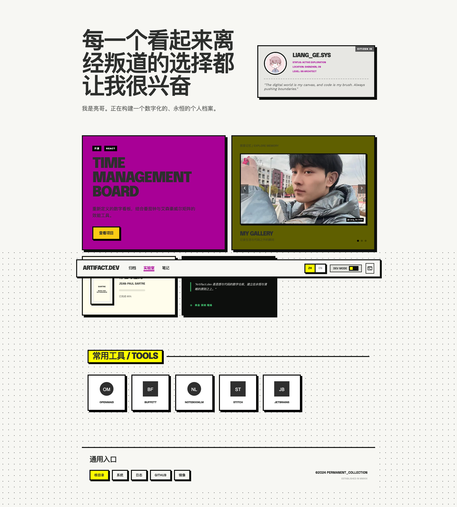
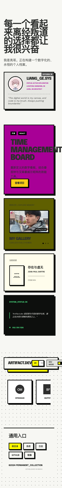

# 🚀 UI 质量检查报告 (待 AI 深度审计)

## 🖼️ 视觉快照 (Visual Snapshots)
### 📱 PC 视图

### 📱 Mobile 视图

## 🖱️ 交互快照 (Interactions)
### 交互项: 归档

### 交互项: 实验室

### 交互项: 笔记

## 🏗️ 页面结构审计 (Semantic Structure)
- [H1] 每一个看起来离经叛道的选择都让我很兴奋
    - [H3] LIANG_GE.SYS
    - [H3] TIME MANAGEMENT BOARD
    - [H3] 探索记忆 / EXPLORE MEMORY
      - [H4] MY GALLERY
    - [H3] 当前阅读
      - [H4] 存在与虚无
    - [H3] SYSTEM_STATUS: OK
  - [H2] 常用工具 / TOOLS
    - [H3] 通用入口

## 🛠️ 初步脚本检测结论
- 🎨 **一致性**: 页面间距 (Gap) 类型过多 (8 种)，建议收敛以保持秩序感。
---
## 🧠 [CRITICAL] AI 深度审计区 (Product Sparring Zone)
> **AI 请注意**：脚本生成的结论仅为基础检测。请立即执行以下操作：
1. **审查布局**：对比最新题案，确认组件权重是否合理（如 Hero 比例、板块删减）。
2. **视觉品控**：检查图片裁剪（如人脸是否完整）、圆角/边框是否符合 Neo-Brutalism。
3. **逻辑一致性**：检查数据占位符是否合理。
4. **大统一报告**：基于此文档，在对话中生成一份图文并茂、带有深度见解的最终报告。

**[等待 AI 填入分析结论...]**